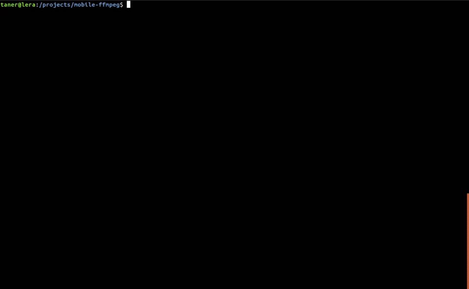
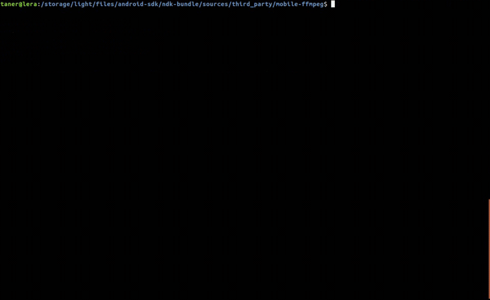

`android.sh` builds FFmpeg for Android platform.

By default five Android ABIs (armeabi-v7a, armeabi-v7a-neon, arm64-v8a, x86 and x86_64) are built without any external libraries enabled.
Options can be used to disable unwanted ABIS and/or enable needed external libraries.

Usage: `./android.sh [OPTION]...`

Please note that options are processed in 'disable-first' order.
When --enable-* and --disable-* options are used together --disable-* options will be applied before --enable-* options.

```
Options:
  -h, --help		display this help and exit
  -V, --version		display version information and exit

Platforms:
  --disable-arm-v7a		do not build arm-v7a platform
  --disable-arm-v7a-neon	do not build arm-v7a-neon platform
  --disable-arm64-v8a		do not build arm64-v8a platform
  --disable-x86			do not build x86 platform
  --disable-x86-64		do not build x86-64 platform

Libraries:
  --full			enables all external libraries

  --enable-android-media-codec	build with built-in media codec
  --disable-android-media-codec	build without built-in media codec

  --enable-android-zlib		build with built-in zlib
  --disable-android-zlib	build without built-in zlib

  --enable-fontconfig		build with fontconfig
  --disable-fontconfig		build without fontconfig

  --enable-freetype		build with freetype
  --disable-freetype		build without freetype

  --enable-fribidi		build with fribidi
  --disable-fribidi		build without fribidi

  --enable-gnutls		build with gnutls
  --disable-gnutls		build without gnutls

  --enable-gmp			build with gmp
  --disable-gmp			build without gmp

  --enable-lame			build with lame
  --disable-lame		build without lame

  --enable-libass		build with libass
  --disable-libass		build without libass

  --enable-libiconv		build with libiconv
  --disable-libiconv		build without libiconv

  --enable-libtheora		build with libtheora
  --disable-libtheora		build without libtheora

  --enable-libvorbis		build with libvorbis
  --disable-libvorbis		build without libvorbis

  --enable-libvpx		build with libvpx
  --disable-libvpx		build without libvpx

  --enable-libwebp		build with libwebp
  --disable-libwebp		build without libwebp

  --enable-libxml2		build with libxml2
  --disable-libxml2		build without libxml2

  --enable-opencore-amr		build with opencore-amr
  --disable-opencore-amr	build without opencore-amr

  --enable-shine		build with shine
  --disable-shine		build without shine

  --enable-speex		build with speex
  --disable-speex		build without speex

  --enable-wavpack		build with wavpack
  --disable-wavpack		build without wavpack
```

#### Example Usage

##### 1. Default build
`android.sh` is called without any options. FFmpeg is built for all five platforms without any external library support.



##### 2. Full build
`android.sh` is called with `--full` option. FFmpeg is built for all five platforms with all external libraries enabled.


##### 3. Custom build
`android.sh` is called with a series of `--enable-*` and `--disable-*` options. Options define which platforms and libraries will be built.

